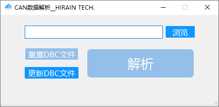

### 软件功能
- 将特定的csv文件转换为可用的数据
- 内置默认DBC文件
- 可自定义更换DBC解析文件

### 如何使用

```shell script
# 新建虚拟环境 venv (虚拟环境目录）
virtualenv venv

# 激活虚拟环境
cd venv/Scripts/
activate

# 安装依赖包
pip install -i requirements.txt

# 启动程序
python app_run.py
```

### 软件截图

